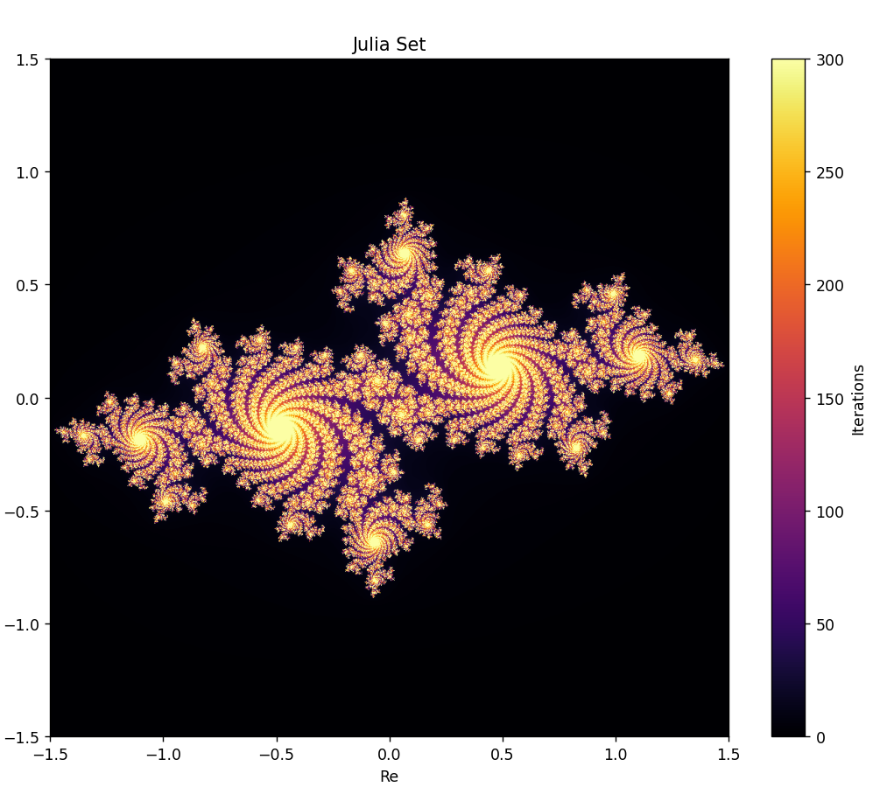
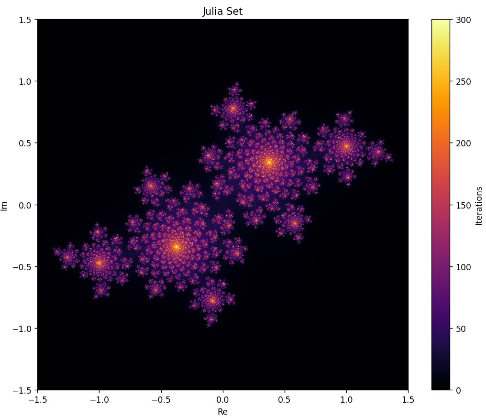
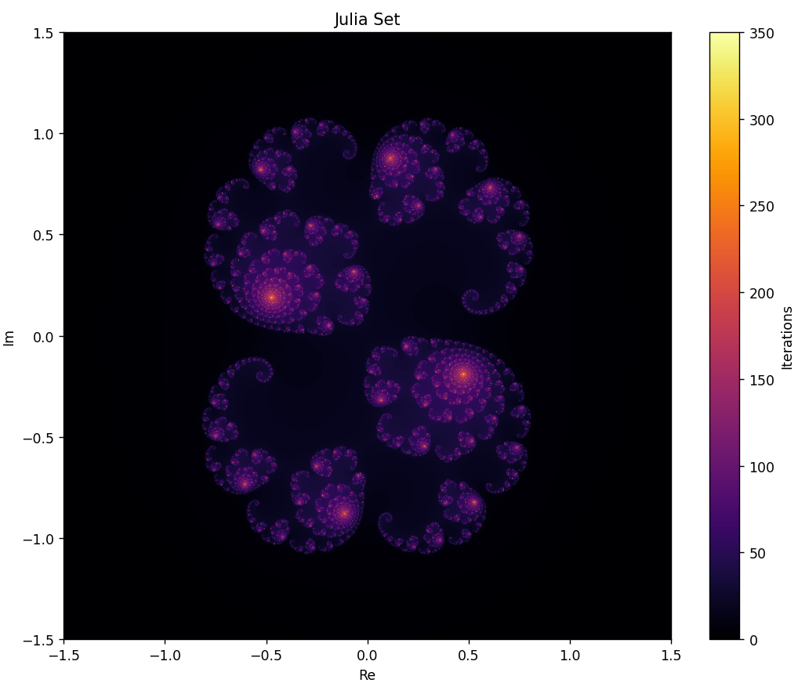
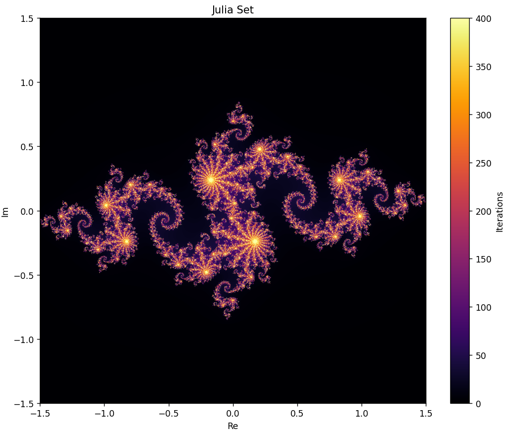

# Fractals Project

Научный проект по моделированию фракталов на Python с использованием NumPy и Matplotlib. Приложение строит множество Жюлиа (Julia set) — визуализирует поведение итерационного процесса `z = z² + c` на комплексной плоскости.

## Примеры результатов

|                                    |                                    |
|------------------------------------|------------------------------------|
|  |  |
|  |  |

Полный отчёт с описанием алгоритма и дополнительными иллюстрациями — в папке [`Отчёт`](./Отчёт).

## Установка

Требуется Python >= 3.10.

```bash
pip install -e .
```

Команда установит зависимости (`numpy`, `matplotlib`) и консольную команду `fractals`.

## Запуск

После установки проект запускается одной командой:

```bash
fractals
```

Откроется окно Matplotlib с изображением множества Жюлиа. Параметры (размер изображения, диапазон плоскости, число итераций, константа `c`) задаются в начале файла `app/app.py`.

## Структура проекта

```
app/            — исходный код приложения
Отчёт/          — отчёт и презентация по работе
ЛР1, ЛР2, ЛР3   — лабораторные работы
assets/         — иллюстрации для README
```

## Лицензия

Проект распространяется под лицензией [MIT](./LICENSE).
